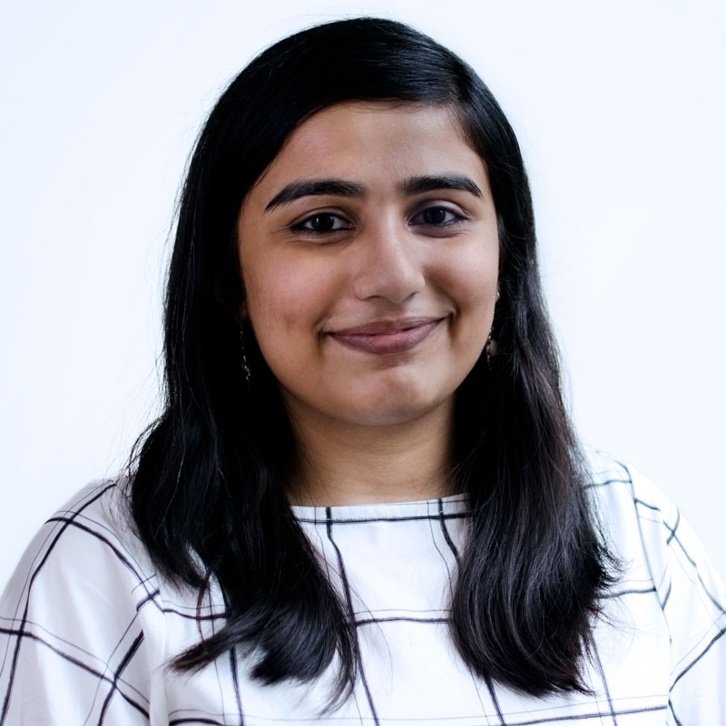

## About Me

Hi! I am PhD student in the Department of Electrical Engineering and Computer Science (EECS) at MIT advised by [Prof. Marzyeh Ghassemi](https://healthyml.org/marzyeh/). My research broadly focuses on developing fair, interpretable, and robust models by carefully re-evaluating and surfacing assumptions in machine learning-based measurements in socially-relevant contexts. Currently, I am supported by an [Amazon fellowship](https://sciencehub.mit.edu/amazon-fellows/) from the [MIT ScienceHub](https://sciencehub.mit.edu/).

Previously, I was a Research Engineer at [Winterlight Labs](https://winterlightlabs.com/). I graduated from the [University of Toronto](https://mscac.utoronto.ca/) with a Master's degree in Applied Computing. My master's project, generously supported by Winterlight Labs and a Mitacs Accelerate Scholarship, was supervised by [Prof. Marzyeh Ghassemi](https://healthyml.org/marzyeh/), [Prof. Frank Rudzicz](http://www.cs.toronto.edu/~frank/), and [Dr. Jekaterina Novikova](https://jeknov.github.io/). Prior to this, I graduated with honors from the [Indian Institute of Technology, Guwahati](https://www.iitg.ac.in/eee/). 

I have also held research intern positions at the Max Planck Institute for Security and Privacy, Bochum (supervised by [Prof. Asia Biega](https://asiabiega.github.io/)), the Technische Universität, Dresden as a DAAD-WISE scholar in 2016 (supervised by [Prof. Carsten Rother](https://hci.iwr.uni-heidelberg.de/vislearn/people/carsten-rother/) and [Prof. Stefan Gumhold](https://tu-dresden.de/ing/informatik/smt/cgv/die-professur/inhaber-in)), and at the [Philips Innovation Campus, Bengaluru](https://www.philips.co.in/a-w/about-philips/philips-innovation-center.html) in the healthcare R&D team in 2017.

Here is my [CV](https://aparna-b.github.io/researcher/resume.pdf).

## Research Interests

Developing and understanding trustworthy machine learning and natural language processing techniques for healthcare applications: particularly by carefully re-evaluating and surfacing assumptions in machine learning-based measurements.

## Conference and Journal

1. Balagopalan, A., Zhang, H., Hamidieh, K., Hartvigsen, T., Rudzicz, F., and Ghassemi, M. (2022). The Road to Explainability is Paved with Bias: Measuring the Fairness of Explanations. In 2022 ACM Conference on Fairness, Accountability, and Transparency (FAccT '22). Association for Computing Machinery, New York, NY, USA, 1194–1206. [/paper/](https://doi.org/10.1145/3531146.3533179)
2. Adam, H., Balagopalan, A., Alsentzer, E. et al. Mitigating the impact of biased artificial intelligence in emergency decision-making. Nature Communications Medicine 2, 149 (2022). [/paper/](https://doi.org/10.1038/s43856-022-00214-4)
3. Balagopalan, A., & Novikova, J. (2021). Comparing Acoustic-based Approaches for Alzheimer's Disease Detection. arXiv preprint arXiv:2106.01555.C onference of the International Speech Communication Association (Interspeech) 2021. [/paper/](https://arxiv.org/abs/2106.01555)
4. Balagopalan, A., Eyre, B., Robin, J., Rudzicz, F., & Novikova, J. (2021). Comparing pre-trained and feature-based models for prediction of Alzheimer's disease based on speech. Frontiers in aging neuroscience, 13, 635945. [/paper/](https://www.frontiersin.org/articles/10.3389/fnagi.2021.635945/full)
5. Balagopalan, A., Eyre, B., Rudzicz, F., Novikova, J. (2020). To BERT or Not To BERT: Comparing Speech and Language-based Approaches for Alzheimer’s Disease Detection. Conference of the International Speech Communication Association (Interspeech) 2020. [/paper/](https://arxiv.org/abs/2008.01551)
6. Balagopalan, A., Novikova, J., Mcdermott, M.B.A., Nestor, B., Naumann, T. & Ghassemi, M. (2019). Cross-Language Aphasia Detection using Optimal Transport Domain Adaptation. Proceedings of the Machine Learning for Health NeurIPS Workshop, in PMLR 116:202-219. [/paper/](http://proceedings.mlr.press/v116/balagopalan20a/balagopalan20a.pdf)

## Book Chapters

1. Seifert, C., Aamir, A.,Balagopalan, A., Jain, D., Sharma, A., Grottel, S.,  Gumhold, S., “Visualizations of Deep Neural Networks in Computer Vision:  A survey”, In Transparent Data Mining for Big and Small Data (pp.  123-144).Springer, Cham., 2017. [/chapter/](https://www.springerprofessional.de/en/visualizations-of-deep-neural-networks-in-computer-vision-a-surv/12273622)

## Teaching Experience

Teaching Assistant, Department of Computer Science, University of Toronto
1. CSC 458:  Computer Networks, Fall 2017
2. CSC 358:  Introduction to Computer Networks, Winter 2018
