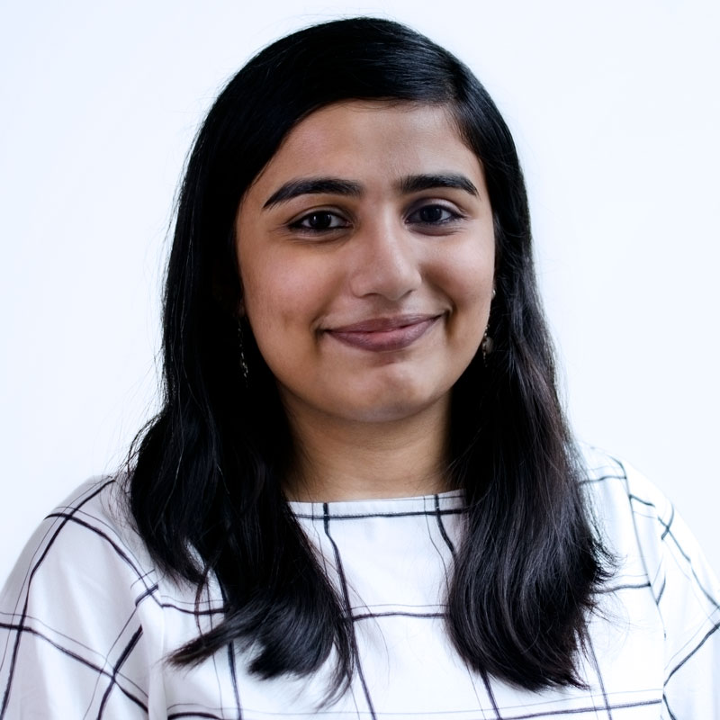

## About Me

Hi! I am a Research Software Engineer at Winterlight Labs. I graduated from the University of Toronto with a Masters degree in Applied Computing in 2019. I graduated with honors from the Indian Institute of Technology, Guwahati in 2017. I am interested in research and applications of machine learning for healthcare. Here is my [CV](https://aparna-b.github.io/researcher/resume.pdf).

## Research Interest

My research interests include clinical natural language processing and machine learning for healthcare. Currently, I am working on research projects in the fields of domain adaptation with unsupervised techniques, machine learning, and speech processing for healthcare applications.

## Publications

1. Balagopalan, A., Novikova, N., McDermott, M. B., Nestor, B., Naumann, T. J., and Ghassemi, M., “Cross-Language Aphasia Detection using Optimal Transport Domain Adaptation”, To appear in Machine Learning for Health (ML4H) at NeurIPS 2019, To appear in PMLR. [/paper/](https://arxiv.org/pdf/1912.04370.pdf)
2. Novikova, J.,Balagopalan, A., Shkaruta, K.,  Rudzicz, F., “Lexical Features Are More Vulnerable, Syntactic Features Have More Predictive Power”, 5th Workshop on Noisy User Generated Text, EMNLP 2019. [/paper/](https://www.aclweb.org/anthology/D19-5556.pdf)
3. Balagopalan, A., Novikova, J., Rudzicz, F.,  Ghassemi, M., “The Effect of Heterogeneous Data for Alzheimer’s Disease Detection from Speech.”, Machine Learning for Health (ML4H) at NeurIPS 2018. [/paper/](https://arxiv.org/pdf/1811.12254.pdf)

## Clinical Abstracts

1. Balagopalan, A., Kaufman, L. J., Novikova, J., Siddiqui, O., Paul, R., Ward, M. and Simpson, W., “Early Development of a Unified, Speech and Language Composite to Assess Clinical Severity of Frontotemporal Lobar Degeneration (FLTD)”, Clinical Trials in Alzheimer’s Disease (CTAD) 2019.
2. Simpson, W., Balagopalan, A., Kaufman, L. J., Yeung, A., and Butler, A., “The Use of a Voice-based Digital Biomarker in Patients With Depression ”, International Society for CNS Clinical Trials and Methodology 2019.
3. Balagopalan, A., Yancheva, M., Novikova, J. and Simpson, W., 2019, “Using Acoustic and Linguistic Markers from Spontaneous Speech to Predict Scores on the Montreal Cognitive Assessment (MoCA). ”, Memory, 20, p.13., 2019.

## Book Chapters

1. Seifert, C., Aamir, A.,Balagopalan, A., Jain, D., Sharma, A., Grottel, S.,  Gumhold, S., “Visualizations of Deep Neural Networks in Computer Vision:  A survey”, In Transparent Data Mining for Big and Small Data (pp.  123-144).Springer, Cham., 2017. [/chapter/](https://www.springerprofessional.de/en/visualizations-of-deep-neural-networks-in-computer-vision-a-surv/12273622)

## Teaching Experience

Teaching Assistant, Department of Computer Science, University of Toronto
1. CSC 458:  Computer Networks, Fall 2017
2. CSC 358:  Introduction to Computer Networks, Winter 2018
